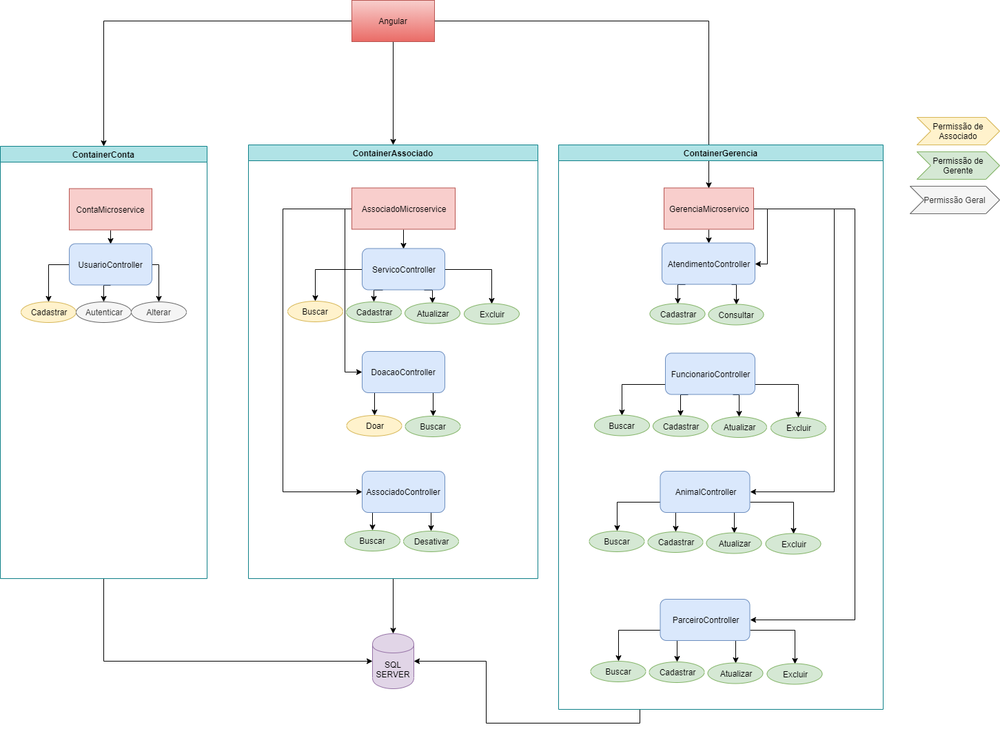

# Arca

Projeto do 7º período sobre ONG de adoção de animais.

## Frontend

Feito em [Angular](https://angular.io/). Usado [AngularMaterial](https://material.angular.io/) como biblioteca de de componentes e o grid layout do [Bootstrap](https://getbootstrap.com.br/docs/4.1/layout/grid/).

## Backend

Feito em [.NETCore](https://docs.microsoft.com/pt-br/dotnet/core/) com [EntityFramework](https://www.entityframeworktutorial.net/efcoreentity-framework-core.aspx) como persistência, [Swagger](https://swagger.io/) como documentador das api e o projeto foi feito usando microservicos. O build das apis foi feito com [Docker](https://www.docker.com/). Banco de dados em [SQLServer](https://www.microsoft.com/pt-br/sql-server/sql-server-downloads).

## Arquitetura Backend

;

## Iniciando desenvolvimento

### Frontend

O sistema está configurado para usar [yarn](https://yarnpkg.com/lang/en/docs/cli/install/). Mas caso ache melhor pode usar o [npm](https://www.npmjs.com/) mesmo. [DependaBot](https://dependabot.com/) irá gerenciar as atualizações das dependências de ambos os pacotes.

Para começar a desenvolver, após baixar o repositório execute `cd arca` para entrar na pasta do projeto front end (caso ainda não esteja) e depois `npm i` (caso use npm) ou `yarn install` para instalar as dependências do projeto. Finalizado a instalação, execute `ng s` para executar o projeto em ambiente de desenvolvimento ou `ng s --open` para executar o ambiente já com o browser aberto. Para mais detalhes de como trabalhar com angular, alguns comandos úteis estão disponíveis [aqui](./arca/README.md).

### Backend

**Ainda desenvolvendo estrutura**